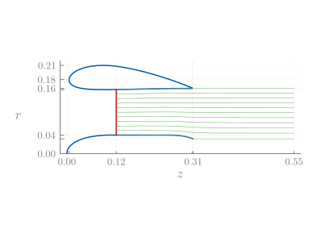
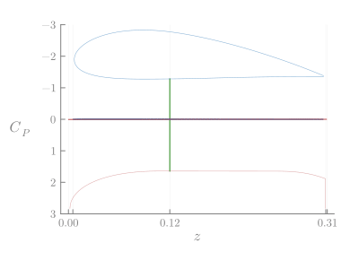
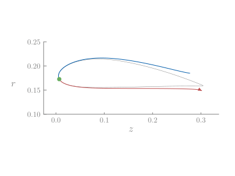

# Visualization

There are several convenience plotting methods implemented in DuctAPE based on [RecipesBase](https://juliaplots.org/RecipesBase.jl/stable/).
In addition a general function for plotting the suite of available plots or animations is provided in the `generate_plots` function.

```@docs; canonical=false
DuctAPE.generate_plots
```

```@setup visualize
using DuctAPE
include("../assets/plots_default.jl")
gr()
```

The following generates animations across the given advance ratios.

!!! warning "Plotting Streamlines"
    Currently, plotting streamlines, especially animations, takes an exceptionally long time.

```@julia
using Plots

# - Advance Ratio Range - #
advance_ratios = range(0.1, 2.0; step=0.01)

# - Calculate Vinfs - #
D = 2.0 * rotor.Rtip[1] # rotor diameter
n = RPM / 60.0 # rotation rate in revolutions per second
Vinfs = advance_ratios * n * D

# - Set Operating Points - #
operating_points = [deepcopy(operating_point) for i in 1:length(Vinfs)]
for (iv, v) in enumerate(Vinfs)
    operating_points[iv].Vinf[] = v
end

# - Run Multi-point Analysis - #
outs, ins, success_flags = DuctAPE.analyze(
    ducted_rotor,
    operating_points,
    reference_parameters,
    DuctAPE.set_options(
        operating_points;
        boundary_layer_options=DuctAPE.HeadsBoundaryLayerOptions(;
            model_drag=true, n_steps=1000, separation_criteria=3.0
        ),
    );
    return_inputs=true,
)

DuctAPE.generate_plots(
    DuctAPE.animatedPlots(),
    Plots, # Pass in the Plots namespace
    ins,
    outs;
    plot_pressure=true,
    plot_velocity=true,
    plot_boundary_layer=true,
    plot_streamlines=true,
    save_path="../assets/",
    static_file_type=".png",
    (;
        custom_defaults...,
        # size=(600,400), # causes misalignment issues
        cp_ylim=(-3, 3), # keyword argument to set ylim for cp plots
        vtan_ylim=(0, 3), # keyword argument to set ylim for vtan plots
        bl_ylim=(0.1, 0.25), # keyword argument to set ylim for boundary layer plots
    )...,
)
nothing # hide
```

!!! note "Custom Defaults"
    Additional arguments splatted into `generate_plots` are passed into `Plots.plot` directly as keyword arguments.  In this case, `custom_defaults` happens to be the defaults associated with the plot formatting used in these docs.  Any arguments passed in this way will override any options set in the plots recipes for all the plots.  In the plots shown here, we have overridden the color palatte, but nothing else.

!!! warning "Custom Sizes"
    For some reason, specifying figure size causes misalignment with pressure and velocity distributions and the underlayed geometry.






